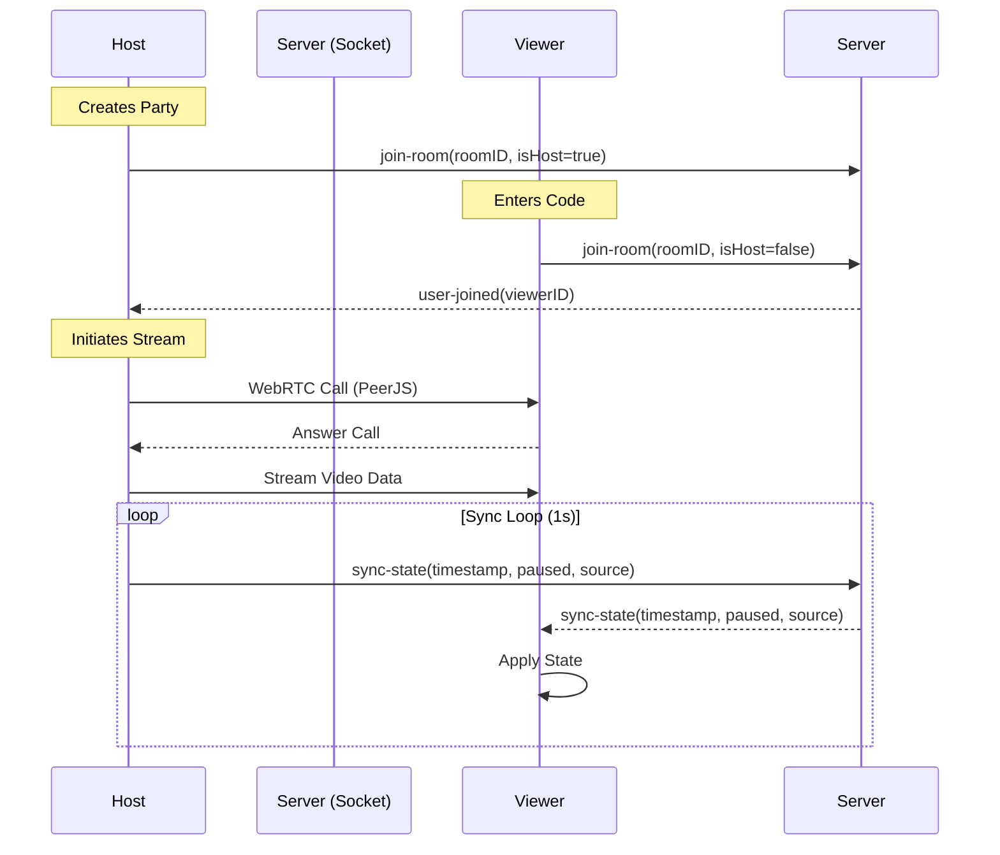
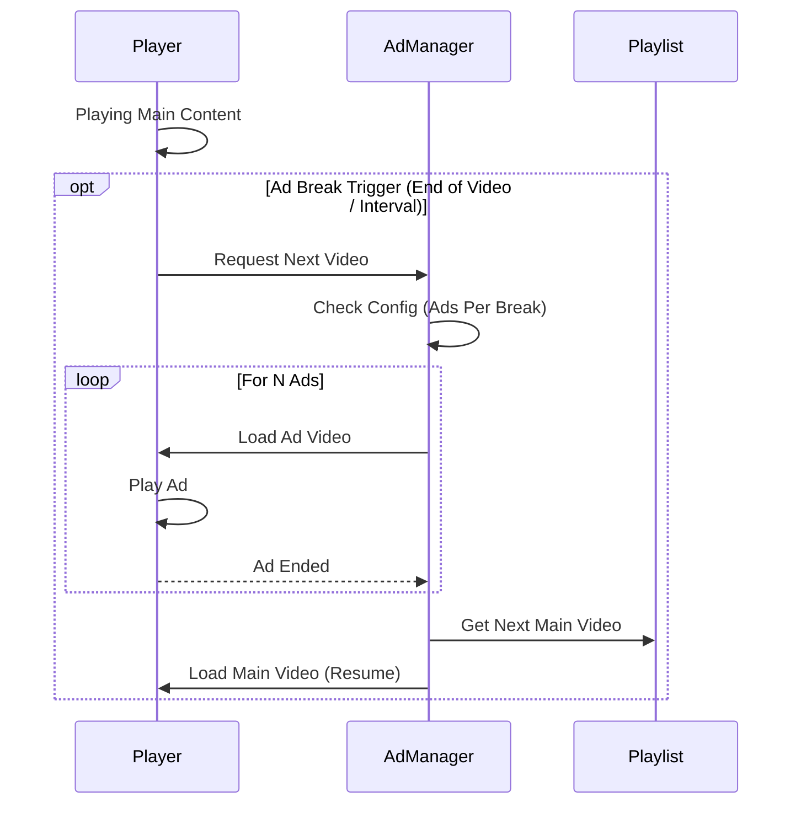

# Retro Room Simulator

[](https://github.com/delsolcrx1)


A web-based retro environment simulator. Load your own background, place a virtual TV screen, and mix ambient audio. Create the perfect cozy vibe or host a watch party with friends.

## Features

- **Custom Backgrounds**: Upload any video or image to serve as the room background.
- **Virtual TV Sources**: 
  - **File Playback**: Upload local video files (MP4, WebM).
  - **YouTube**: Paste URLs to play videos or playlists.
  - **Channels**: Create custom curated channels using JSON playlists.
  - **Gaming Mode**: Play NES and Sega Genesis/Mega Drive games via EmulatorJS.
  - **Dial-Up Web**: Browse the web (proxy-friendly sites) with a retro dial-up connection sequence.
- **Watch Party**: Host a room where friends can join via code. Syncs video content (including local file streams via PeerJS) and background settings in real-time.
- **Ad Simulation**: Configurable ad breaks for YouTube playlists to simulate the broadcast TV experience.
- **Chroma Key / Manual Placement**: Place the TV content onto a green screen area in your background, or manually draw the position.
- **Audio Mixer**: Mix 4 tracks of ambient noise (Birds, Traffic, Lawnmower, Talking) + TV Volume. Supports custom MP3 uploads for each track.
- **Visual Effects**: 
  - **CRT Overlay**: Dynamic scanlines with intensity and scope control (Screen vs TV Only).
  - **TV Post-Process**: Adjust Brightness, Contrast, Saturation, Blur, Sepia, and Hue.

## System Architecture

### Watch Party Flow
The Watch Party system uses **Socket.io** for state synchronization (play/pause, timestamp, config) and **PeerJS (WebRTC)** for high-quality video streaming of local files.



### Ad Injection Logic
To simulate broadcast television, the Ad Manager intercepts playback during playlists.



## Getting Started

1. **Install Dependencies**:
   ```bash
   npm install
   ```

2. **Start Server**:
   ```bash
   npm start
   ```
   Open `http://localhost:3000` in your browser.

3. **First Run**:
   - The screen will say "NO SIGNAL".
   - Click "UPLOAD ROOM SOURCE" or use the sidebar to upload a background image/video.
   - Click "START AUDIO" in the Audio Mixer to enable sound.

## Controls

### Remote Control (Right Panel)
- **Tabs**:
  - **FILE**: Upload local video files.
  - **URL**: YouTube links.
  - **CHANNELS**: Pre-configured channel lists.
  - **GAMES**: Load ROMs (NES/Genesis).
  - **WEB**: Retro browse with dial-up.
  - **PARTY**: Host or Join a watch party.
- **Playback**: Play/Pause, Seek, Eject.
- **Power**: Toggles the TV screen visibility.
- **Volume**: Controls TV volume independent of ambient noise.

### Sidebar (Left Panel)
- **Placement Method**: 
  - **Chroma Key**: Automatically replaces green/blue areas with the TV video. Adjust Threshold/Softness.
  - **Manual**: Check "MANUAL SELECTION" to drag/resize the TV screen box.
  - **Visual Effects**: Toggle CRT effects and adjust TV image filters.
  - **Audio Mixer**: Adjust levels for ambient sounds. Click the icons to toggle specific tracks on/off.

## Custom Channels
Create folders in `channels/` with a `channel.json` file:
```json
{
  "title": "My Channel",
  "url": "https://youtube.com/playlist?list=...",
  "img": "icon.png",  // place icon.png in the same folder
  "channel": 1        // Sort order
}
```

## Troubleshooting
- **Audio not working?** Modern browsers block auto-playing audio. You MUST click the "START AUDIO" button in the mixer panel once after loading the page.
- **Watch Party Video Black?** Ensure the Host is playing the file. Background images/videos loaded from disk on the Host are not synced to Viewers (security restriction); only the TV content streams.
